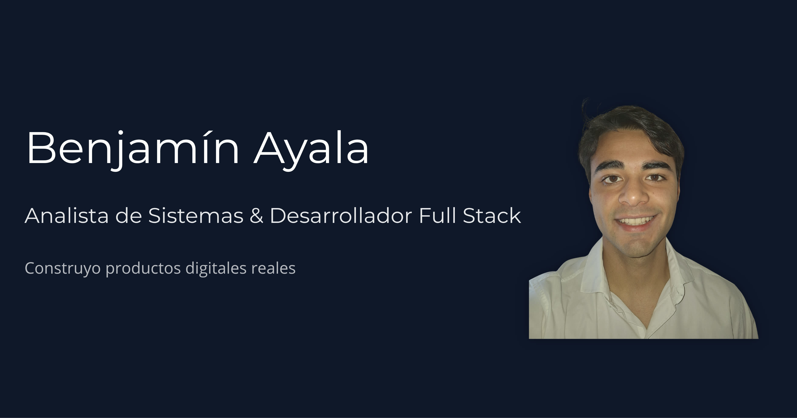

# Benjamín Ayala — Portfolio (Systems Analyst & Full Stack Developer)



Hi! I'm Benjamín, a Systems Analyst and Full Stack Developer. Welcome to the code behind my interactive portfolio.

I built this project from scratch to move away from generic templates and actually showcase my coding standards, my focus on performance, and how I structure a real React application today.

## 🚀 Built With

*   **React (SPA) + Vite:** Kept it as a fast Single Page Application without the overhead of heavier frameworks since it's mostly a client-side experience.
*   **Tailwind CSS:** Pure utility classes for styling. No heavy UI component libraries.
*   **Framer Motion:** Used for smooth scroll animations and layout transitions. I kept them light and hardware-accelerated to stay at 60 FPS on mobile.
*   **Base64 Email Obfuscation:** Instead of leaving my email in plain text for spam bots to scrape, I obfuscated it and decode it on the fly when the user clicks.
*   **Vercel Serverless Functions:** The contact form doesn't rely on third-party `mailto` links; it securely hits a small Node.js serverless endpoint I wrote to talk to the Brevo API.
*   **React.lazy() & Suspense:** Not everything needs to load at once. The case studies and footer only load when you scroll down, keeping the initial load fast.
*   **Error Boundaries:** Wrapped the app to catch rendering errors gracefully without giving the user a white screen of death.
*   **i18n (Internationalization):** Fully bilingual (English/Spanish) using a custom lightweight context hook.
*   **Security & SEO:** Configured `vercel.json` and meta tags for CSP (Content Security Policy) to prevent clickjacking, and added proper Open Graph tags for social media sharing.

## 📂 Folder Structure

I organized the codebase around the **Feature-Sliced Design** concept. Coming from a Systems Engineering background, high cohesion and low coupling are must-haves for me.

```text
📦 src
 ┣ 📂 api               # Vercel Serverless Function for the contact form
 ┣ 📂 app               # React entry point (App.jsx)
 ┣ 📂 core              # Global logic: context providers, custom hooks, and shared UI
 ┣ 📂 data              # Static data models for the projects to keep components clean
 ┣ 📂 features          # Isolated modules (hero, studies, contact section)
 ┗ 📂 translations      # Dictionaries for the English/Spanish toggle
```

## ⚙️ Running it Locally

If you want to spin it up on your machine:

1. Clone the repo and install dependencies:
   ```bash
   npm install
   ```

2. Set up your environment variables (you'll need a free Brevo API key if you want to test the email feature):
   ```bash
   # Create a .env.local file
   VITE_BREVO_API_KEY="your-api-key"
   VITE_CONTACT_EMAIL="your-email@domain.com"
   ```

3. Start the Vite development server:
   ```bash
   npm run dev
   ```

## 🔐 About the Code
Feel free to look around, read the components, and check out how I structured the application! I just ask that you don't copy the exact design/branding for your own portfolio. 

If you have any questions about the architecture or want to connect, feel free to reach out.